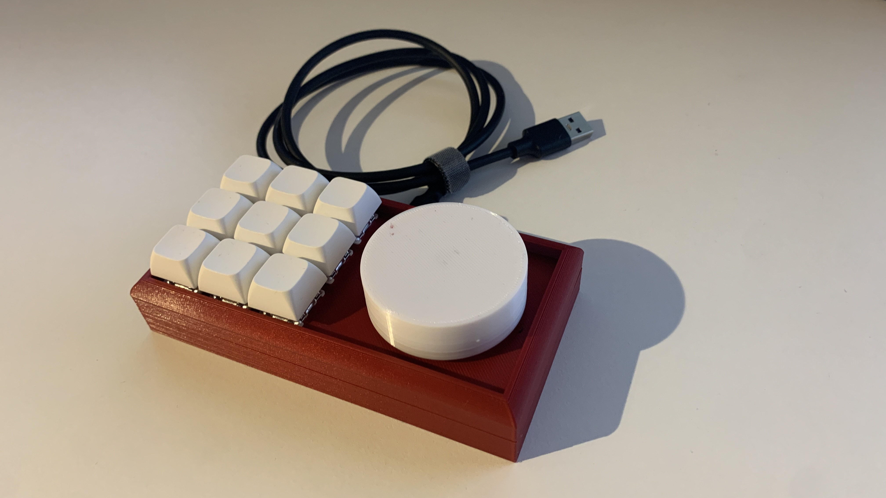
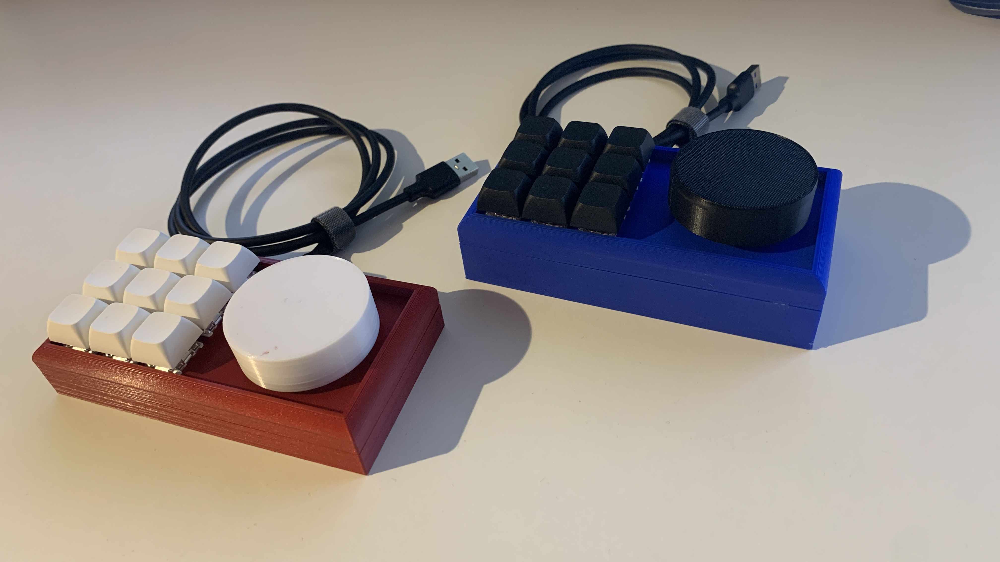
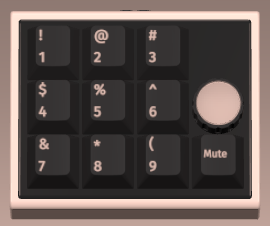
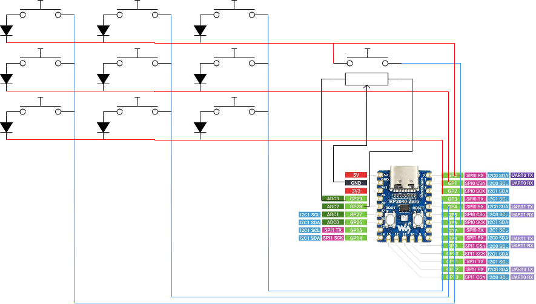

# KeyMaster
This is a simple 3x3 macro pad with a rotary encoder based on the RP2040 Raspberry Pi Pico. 
You have 9 full programmable buttons and a jog wheel with an extra button. To program your key codes, you can use [VIA](https://www.caniusevia.com/). 


- [Hardware:](#hardware)
- [Build your own](#build-your-own)
- [Firmware](#firmware)
- [Bootloader](#bootloader)






## Hardware:

* Keyboard Maintainer: [Bastian Reuther](https://github.com/bastifpv)
* Hardware Availability: 
    - [Pi Pico Zero](https://www.waveshare.com/rp2040-zero.htm) 
    - [Keychron K Pro Switch](https://www.keychron.com/products/keychron-k-pro-switch)
    - [1N4148 Diodes](https://www.amazon.de/Hailege-100PCS-1N4148-IN4148-High-Speed/dp/B07YZ8G7TG/ref=sr_1_6?__mk_de_DE=%C3%85M%C3%85%C5%BD%C3%95%C3%91&crid=N5YHFBVFQFPE&keywords=diode+100+pack&qid=1695635790&sprefix=diode+100+pack%2Caps%2C92&sr=8-6)
    - [Rotary Encoder](https://de.aliexpress.com/item/1005003672156760.html?spm=a2g0o.productlist.main.9.4d113mB63mB6OE&algo_pvid=695d0713-7b80-4c50-9ac2-63957315c66a&aem_p4p_detail=202312040738008585315538620850003585044&algo_exp_id=695d0713-7b80-4c50-9ac2-63957315c66a-4&pdp_npi=4%40dis%21EUR%212.28%212.12%21%21%212.42%21%21%402103890117017042806291571eaaaf%2112000026741773793%21sea%21DE%210%21AB&curPageLogUid=GmiH1mOTxMkl&search_p4p_id=202312040738008585315538620850003585044_5)


## Build your own
- Print the STL files [Link](https://www.printables.com/de/model/669777-keymaster-makropad-3x3-with-roatry-encoder-qmkvia)
- Insert the Switches and the encoder
- Solder the Matrix and the encoder
- Set up qmk and change the pins in the firmware
- Build and flash the image


## Firmware
Copy this folder to `qmk-firmware/keyboards/`

Compile example for this keyboard (after setting up your build environment):

```bash
qmk compile -kb KeyMaster -km via
```

See the [build environment setup](https://docs.qmk.fm/#/getting_started_build_tools) and the [make instructions](https://docs.qmk.fm/#/getting_started_make_guide) for more information. Brand new to QMK? Start with our [Complete Newbs Guide](https://docs.qmk.fm/#/newbs).

## Bootloader
Enter the bootloader in 2 ways:
* **Bootmagic reset**: Hold down the key at (0,0) in the matrix (usually the top left key or Escape) and plug in the keyboard
* **Physical reset button**: Briefly press the ´BOOTSEL´ button on the Pi Picos
